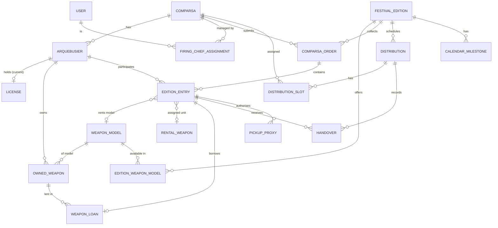

# Domain Model

> Status: **v1.0** (after round 5). Conceptual model — not a database schema yet.
> Terms follow `glossary.md`.

## 1. Overview

## 2. Entities

### Registry (not edition-scoped)

**Comparsa** — `name`, `side` (`MOORISH` | `CHRISTIAN`), `active`, `logo` (optional image, uploaded by an
Admin; change `add-comparsa-logos`). Real comparsa logos are third-party brand assets: never committed.
Logo rules (blocking): JPEG, PNG or WebP of at most 10 MB and 40 megapixels (no SVG); the long side at
least 256 px and at most 3 times the short side. The server re-encodes it as PNG keeping its
transparency, strips its metadata and scales it down to at most 1024 px. Only Admins add, replace
or remove it; anyone who can see the comparsa sees it (BR-12). Deactivating keeps the logo; deleting
the comparsa erases it. It is shown in the comparsa list and detail and in a FiringChief's sidebar.
The `name` is unique ignoring case (blocking). Admins deactivate a comparsa that no longer takes part
but keeps history, and delete one entered by mistake or never used.

**Deletion of catalogue records** — comparsas and weapon models can be deleted by an Admin only while
no other record references them (blocking; later modules report their references through the
catalog's usage contract). Deleting a comparsa removes its FiringChief assignments. The audit trail
keeps a snapshot of what was deleted.

**User** — `email` (unique, sign-in name), `name`, `role` (`ADMIN` | `FIRING_CHIEF`), `locale`
(`es-ES` | `ca-ES-valencia` | `en`, used for emails and applied at sign-in), `active`, `createdAt`,
`lastSignInAt`. Credentials (password hash, authenticator key, recovery codes, lockout) are managed by
ASP.NET Core Identity in the `identity` schema. **Status** is derived: `DEACTIVATED` if not active,
otherwise `INVITED` while there is no password, else `ACTIVE`. At least one active Admin must always
remain (blocking).

**FiringChiefAssignment** — `user`, `comparsa`. A comparsa can have several FiringChiefs and a
FiringChief several comparsas; the assignments are exactly a FiringChief's comparsa scope (BR-12).
Only `FIRING_CHIEF` users that are not deactivated can be newly assigned, and only to active
comparsas (blocking); existing assignments are kept when the user or the comparsa is deactivated
or the user becomes an Admin (no effect while Admin), and removed when the comparsa is deleted.
Managed by Admins from both the comparsa and the user pages (maintainer decision).

**Arquebusier**
| Field | Notes |
|---|---|
| `federationId` | Whole number 1–999 999 999, unique. ID in the Federation's external app. Required (always known at sign-up). |
| `nationalId` | DNI (8 digits + letter) or NIE (X/Y/Z + 7 digits + letter), stored normalised (spaces, tabs and hyphens removed, uppercase, ASCII only), check letter validated (BR-01). Unique (BR-02). The spreadsheet import pads a DNI that lost its leading zeros (the check letter does not change); the form does not. |
| `firstName`, `lastName` | 1–100 characters, trimmed, no line breaks or invisible characters. |
| `birthDate` | Not in the future, not before 1900-01-01. Age is derived, never stored. |
| `email`, `phone` | Optional. Email: plain address, stored lower-case. Phone: digits and spaces with an optional leading `+`, at most 20 characters. |
| `gender` | Kept for equality reports (`MALE` \| `FEMALE` \| `UNSPECIFIED`). |
| `idPhoto` | Portrait photo (file), printed on the arquebusier badge. **Optional** but expected (maintainer decision, `add-arquebusier-photos`): existing arquebusiers, the spreadsheet import (#8) and failed uploads leave arquebusiers without one, shown as "No ID photo". 3:4 portrait within 1 %, at least 600 × 800 px, stored at most 1200 × 1600 (NFR-15). |
| `trainingCompletedOn` | Date the mandatory course was done, not in the future; null = not done. |
| `comparsa` | Current comparsa; new arquebusiers only in an active one. Changes only by a transfer (Admin, UC-29), never by an edit; past entries keep their comparsa (BR-13). |
| `status` | **`ACTIVE` \| `RESERVE`** — the only status, `ACTIVE` by default. `RESERVE` = not firing (0 kg) but kept on the list (e.g. inactive for a few years, or available as pickup proxy). Leaving the Federation ⇒ the arquebusier is **deleted**. |

Edits carry a version (PostgreSQL `xmin`): an edit based on outdated data is rejected, so two
FiringChiefs of one comparsa never overwrite each other silently.

**Spreadsheet import** (UC-09, `add-registry-import`) — an Admin imports the PolvorApp template
for one active comparsa. The file is checked first (a report per row: the registration's blocking
rules, duplicates inside the file and against the registry, and the compliance warnings), then
imported only when no row has an error, all rows in one transaction. It only creates arquebusiers
(license, course and status included; no owned weapons, no photos) and never changes existing ones.
Uploaded files are read in memory and never stored. Nothing new is stored beyond the arquebusiers.

**License** (current only, no history, no number) — `type` (`AE` | `A_PROF`), `issuedOn`, `expiresOn` (default: AE `issuedOn + 5 years`, A-PROF `issuedOn + 1 year`), `status` (`PENDING` | `VALID` | `EXPIRED` derived from today in Europe/Madrid: valid through its expiry day; no status without a license), `frontPhoto`, `backPhoto`. A pending license has no dates; an issued one has both, `expiresOn` after `issuedOn`, and `issuedOn` not in the future. Renewal replaces the previous data; the photos are kept until new ones are uploaded (maintainer decision), and removing the license deletes them.

**Photos** (`ArquebusierPhotoKind`: `ID`, `LICENSE_FRONT`, `LICENSE_BACK`; change `add-arquebusier-photos`) —
at most one of each kind per arquebusier, all optional. License photos need a license (pending or
issued; blocking). Uploads are JPEG, PNG or WebP of at most 10 MB and 40 megapixels; the server turns
them upright, re-encodes them as JPEG and strips every metadata (SEC-12). License photos need a long
side of at least 800 px and sides within a factor of 2, and are stored at most 2000 px on the long
side. Uploading a kind that exists replaces it and erases the previous image. Images live in private
object storage under random names; the database only holds the reference (`registry.arquebusier_photos`),
so an upload never changes the arquebusier's version.

**WeaponModel** (catalogue) — `kind` (`TRABUCO` | `ARCABUZ` | `PISTOL`), `side`, `handedness` (`RIGHT` | `LEFT`), `size` (`NORMAL` | `SMALL`), `rentable` (never for pistols, BR-07), `label` (Federation naming, e.g. "TRABUCO CRISTIANO DIESTRO (PEQUEÑO)", unique ignoring case), `active`.
Side, handedness and size are required for trabucos and arcabuces, whose kind × side × handedness × size
combination is unique; for pistols they are optional. Kind and side combine freely (maintainer decision:
Federation labels such as "ARCABUZ CRISTIANO" do not follow Q-07 strictly; Q-53).

**OwnedWeapon** — `owner` (Arquebusier), `model` (any catalogue kind, pistols included; active when added or changed), `weaponNumber` (engraved, 1–30 characters, **not** unique: numbers of different makers can coincide), `ownershipGuideNumber` (1–30 characters, stored upper-cased, unique across the Federation ignoring case — maintainer decision).

### Edition-scoped

**FestivalEdition** — `year` (unique, fixed at creation), festival dates (`festivalStartsOn`, `festivalEndsOn`), `status` (`DRAFT` \| `IN_PROGRESS` \| `CLOSED`), `ordersOpen` flag (meaningful only when `IN_PROGRESS`), planned order window dates (`ordersOpenOn`, `ordersCloseOn`, both optional). Prices (`EditionPrices`, columns of the edition) are euros with two decimals (numeric(6,2)): `powderPerKg`, `capsBox`, `weaponRental`, `flaskRental` (optional while `DRAFT`, required once `IN_PROGRESS`). At most one edition is `IN_PROGRESS` at a time (the **current edition**). Registry lock (see below) blocks FiringChief writes to the registry while on.

**EditionWeaponModel** — which `WeaponModel`s are rentable in an edition (copied from the previous edition at creation, then editable). A model that becomes inactive or non-rentable after being offered stays in the set until an Admin removes it, but is no longer offered for rental.

**CalendarMilestone** — `date`, `title` (up to 50 per edition); added, edited and removed by Admins in any status. No `notify` field until change #14.

**RegistrySettings** — a single row holding the registry lock state (`locked` boolean, `lockedChangedAt` timestamptz). When locked, FiringChief writes to the registry are refused (`409 registry.locked`); Admins keep writing. The lock is independent of editions and is toggled by Admins.

**ComparsaOrder** (change `add-comparsa-orders`) — `edition` (with its `year` copied), `comparsa`, `status` (`DRAFT` | `SUBMITTED` | `RETURNED` | `VALIDATED`), `preparedAt`/`preparedBy`, `submittedAt`/`submittedBy`, `attested` (a FiringChief confirms their arquebusiers meet the requirements) or `submittedByAdmin` (an Admin submitted it on the comparsa's behalf, without attestation), `reviewedAt`/`reviewedBy`, `returnReason` (1–500 characters, while returned). At most one per comparsa and edition (blocking). A comparsa without an order is "not prepared" (not stored). Orders are never deleted.

**BillingSummary** (change `add-billing-summary`, UC-28; derived, never stored) — what a comparsa owes
the Federation for its order: four lines, each `quantity × unit price = amount`, and their total.
Powder is the entries' `powderKg` at `powderPerKg`; caps are the boxes of both types at `capsBox`;
weapon rentals are the `RENTAL` entries of any model at `weaponRental`; flask rentals are the 1 kg
and 2 kg rented flasks at `flaskRental`. Owned weapons, loans, owned flasks and `RESERVE` entries
are never charged. It always uses the order's current entries and the edition's current prices,
so a price change moves every summary of the edition. It is **provisional** until the order is
`VALIDATED` and **final** while it is. A line whose price is not set (only in an edition moved
back to draft) has no amount, and the summary then has no total and names the missing prices.
Admins also see the edition billing: the prepared orders' quantities summed and priced once, final
only when there is at least one prepared order and every one is validated. Payments are out of
scope.

**Export definitions** (change `add-exports`, UC-17; code, not data) — a named, versioned layout of
rows and columns rendered as Excel and as PDF, generated per request and never stored:
`powder-supplier` (powder and caps per comparsa, no personal data), `rental-company` (who rents a
weapon model or a flask), `arms-authority` (each `ACTIVE` entry with a weapon: license from the
registry, weapon data, lender for a loan) and `comparsa-list` (a comparsa's order). The recipient
exports read only `VALIDATED` orders; the comparsa list reads an order in any status and is a
**draft** until the order is validated. Every definition is **provisional** (version
`provisional-1`) until the recipients' templates arrive (Q-44): the file name, its first lines and
the screen say so.

**EditionEntry** (one per arquebusier per edition, at most one, created when the order is prepared or the arquebusier is added)
| Field | Values |
|---|---|
| `arquebusier` | link to the registry; null once the arquebusier is deleted |
| `status` | `ACTIVE` \| `RESERVE` for this edition; starts as the registry status and is independent afterwards |
| `powderKg` | 0 \| 1 \| 2 |
| `capsBoxes`, `capsType` | 0–99, `NORMAL` \| `SMALL` (type exactly when there are boxes) |
| `weaponSource` | `OWNED` \| `RENTAL` \| `LOAN` \| `NONE` |
| `ownedWeapon` | if `OWNED`: one of the arquebusier's owned weapons; null once it leaves the registry |
| `rentalModel` | if `RENTAL`: a model offered for rental in the edition (BR-07) |
| `flask` | `OWNED` \| `RENTAL_1KG` \| `RENTAL_2KG` \| `NONE` |
| history copy | `firstName`, `lastName`, `nationalId`, `federationId`, and for `OWNED` the weapon's model, `weaponNumber` and `ownershipGuideNumber` |

An `ACTIVE` entry may have no powder or no weapon: some arquebusiers only carry powder and others
only fire, such as the comparsa captains. `rentalWeapon` and `rentalFlaskNumber` (units assigned at
distribution) arrive with #13 and UC-21.

The **history copy** is refreshed from the registry when the entry is created and saved, and when
its order is submitted or validated, while the links exist. Screens show the live registry data
while it exists, and the copy afterwards, so entries keep reading correctly as the edition's
history (design D3 of `add-comparsa-orders`).

**WeaponLoan** — `borrowerEntry` (one loan per entry with weapon source `LOAN`) and a lender of one
of two kinds:
- `ARQUEBUSIER`: a registered arquebusier of any comparsa and one of their owned weapons;
- `EXTERNAL`: an owner who is not in PolvorApp.

Both kinds store the lender's `firstName`, `lastName`, `nationalId` (and comparsa, if registered)
and the weapon's model, `weaponNumber` and `ownershipGuideNumber`. They are typed by hand for an
external owner and copied for a registered one. An owned weapon may be lent to several borrowers.

**RentalWeapon** — `edition`, `model`, `weaponNumber`, `assignedEntry`. Return is handled by the rental company (out of scope).

### Distribution (edition-scoped)

**Distribution** — `edition`, `type` (`POWDER` | `WEAPONS`), `date`, `location`.

**DistributionSlot** — `distribution`, `comparsa`, `startsAt`.

**PickupProxy** (exceptional) — `holderEntry`, `proxyEntry`, `type` (`POWDER` | `WEAPON`), `reason`. The app prints the pre-filled authorisation form; it is signed on paper.

**Handover** (later, UC-21) — `distribution`, `entry`, `distributionNumber`, `collectedBy` (holder or proxy entry), `collectedAt`, `powderKg`, `traceability1`, `traceability2`, `weaponNumber`, `rentalFlaskNumber`. Must work **offline** and sync later. No signatures: the FiringChief validates identities.

### Cross-cutting

**CalendarMilestone** — `edition`, `date`, `title`, `notify` (email reminders).

**Note** — `comparsa`, `author`, `date`, `text` (internal comparsa notes).

**AuditEntry** (append-only, `audit` schema) — `occurredAt`, `actorUserId` (null for anonymous
events such as a failed sign-in), `action`, `entityType`, `entityId`, `comparsaId`, `traceId`, `data`
(small JSON, never secrets). Written in the same transaction as the change it records (GDPR
accountability and dispute resolution).

## 3. Business rules

| ID | Rule | Enforcement |
|---|---|---|
| BR-01 | `nationalId` must be a valid DNI or NIE (check letter). Look-alike non-Latin characters are rejected. | Block |
| BR-02 | `nationalId` and `federationId` are unique across the whole Federation. | Block |
| BR-03 | License `expiresOn` defaults to `issuedOn + 5 years` (AE) or `+ 1 year` (A-PROF). | Default, editable |
| BR-04 | An ACTIVE entry should have: valid license at festival dates, course done, legal age (18). In the registry the same rules are evaluated today, in Europe/Madrid, for `ACTIVE` and `RESERVE` arquebusiers, as compliance warnings (`add-compliance-insights`); edition entries are evaluated on the festival dates in #10. | **Warning** — the FiringChief is accountable and attests on submission |
| BR-05 | `powderKg` ∈ {0, 1, 2} per edition. A RESERVE entry has no powder, caps, weapon or flask. An ACTIVE entry may have no powder or no weapon (powder carriers, shooters such as the comparsa captains). | Block |
| BR-06 | A PickupProxy must have an entry (ACTIVE or RESERVE) in the same edition; per the current form, in the same comparsa. | Block |
| BR-07 | A rental model must be available in the edition. Pistols are never rentable. | Block |
| BR-08 | A rental weapon is assigned to exactly one entry and is non-transferable. | Block |
| BR-09 | A weapon loan comes from an OwnedWeapon of an arquebusier of any comparsa, or from an external owner who is not in PolvorApp (with their name, DNI/NIE and the weapon's model, number and ownership guide). No limit on loans. | Block (data rules) |
| BR-10 | The **registry lock** (independent of editions) blocks FiringChief writes to the registry; Admins always write. FiringChiefs can edit orders only while the orders of the current edition are open; otherwise read-only. Admins can always edit orders (exceptional cases). | Block |
| BR-11 | No powder carryover between editions. | — |
| BR-12 | FiringChiefs only see and edit their own comparsa (except loans, where the borrower's name is visible). | Block |
| BR-13 | A transfer moves the arquebusier to the new comparsa for future editions only. | — |
| BR-14 | Deleting an arquebusier (left the Federation) erases their registry data, owned weapons and photos (the images right after the deletion, or by the hourly orphan sweep if that fails). While the orders of the edition in progress are open, their entry in it is removed, after a confirmation that says so. Every other entry (past editions, and the edition in progress once its orders are closed) is kept as history with its copy of the identity and weapon data; it is anonymised only on a GDPR erasure request (UC-26). | — |

## 4. Arquebusier badge (UC-30)

Derived document — nothing new is stored. Current badge (reference photo in `sources/`, not versioned):

- Landscape card, **Federation green** header band with the word **"ARCABUCERO"** and the
  Federation name ("Unión de Comparsas de Moros y Cristianos \"Ber-Largas\"").
- Federation coat of arms.
- ID photo.
- Labelled fields: **Apellidos**, **Nombre**, **DNI**, **Código** (`federationId`),
  **Fecha de caducidad** (license `expiresOn`), **Comparsa**.
- Free area where the Federation **stamps its seal by hand** — keep it empty in the PDF.

**Physical format**

- **Credit-card size — ISO/IEC 7810 ID-1: 85.60 × 53.98 mm**, landscape. Printed by the
  Federation on **cardstock** and worn around the neck in a standard ID-1 **plastic sleeve**.
- The PDF is a print sheet: **A4 portrait, 10 badges per sheet (2 × 5)**, each at exact size,
  with **crop marks**, so badges can be cut by hand. Printing at 100 % scale (no "fit to page").
- Safe area: keep text and photo ≥ 3 mm from the card edge; background band may bleed to the edge.
- ID photo slot **3:4 portrait** (~20 × 26.7 mm); source photo ≥ 600 × 800 px so it prints sharp at 300 dpi.
- Batch generation per comparsa or per selection (e.g. only new or renewed licenses).
- Badge labels stay in Spanish (official document) ❓ — to confirm with the Federation.

## 5. Derived data (never stored)

Age, next birthday, license expiry in months, license status, statistics (age brackets, gender,
course, owned weapons, first year), "first year" flag.

**First year** (UC-07, `add-comparsa-orders`): an arquebusier is in their first year in an edition
when they have no `ACTIVE` entry in an edition with an earlier year (a `RESERVE` entry does not
count; entries no longer linked to the registry are ignored). The flag is **known** only once an
earlier edition has at least one comparsa order; before that PolvorApp has no history and the flag
is neither shown nor counted. It is shown on each order entry (for the order's edition) and on the
arquebusier detail (for the edition in progress), and the statistics count it by gender.

**Compliance warnings** (`ComplianceWarning`, BR-04, `add-compliance-insights`), derived on a reference
date (today in Europe/Madrid for the registry) and returned in this order:

| Code | Condition |
|---|---|
| `LICENSE_MISSING` | No license |
| `LICENSE_PENDING` | The license is pending |
| `LICENSE_EXPIRED` | The license expired before the reference date |
| `LICENSE_EXPIRING` | The license is valid but `expiresOn` is earlier than the reference date + 12 months ("expiring soon") |
| `COURSE_MISSING` | No `trainingCompletedOn` |
| `UNDER_AGE` | Younger than 18 (legal age, Q-54) |
| `ID_PHOTO_MISSING` | No `idPhoto` |
| `LICENSE_PHOTOS_MISSING` | The license is issued and lacks its `frontPhoto`, its `backPhoto` or both |

At most one license warning applies. Statistics age brackets: under 25, 25–34, 35–44, 45 or older.
