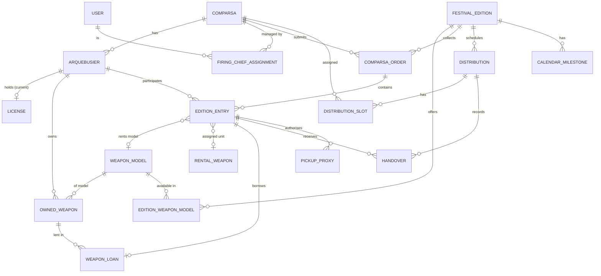

# Domain Model

> Status: **v1.0** (after round 5). Conceptual model — not a database schema yet.
> Terms follow `glossary.md`.

## 1. Overview

## 2. Entities

### Registry (not edition-scoped)

**Comparsa** — `name`, `side` (`MOORISH` | `CHRISTIAN`), `active`, `logo` (optional image, uploaded by an
Admin; change `add-comparsa-logos`). Real comparsa logos are third-party brand assets: never committed.
The `name` is unique ignoring case (blocking). Admins deactivate a comparsa that no longer takes part
but keeps history, and delete one entered by mistake or never used.

**Deletion of catalogue records** — comparsas and weapon models can be deleted by an Admin only while
no other record references them (blocking; later modules report their references through the
catalog's usage contract). Deleting a comparsa removes its FiringChief assignments. The audit trail
keeps a snapshot of what was deleted.

**User** — `email` (unique, sign-in name), `name`, `role` (`ADMIN` | `FIRING_CHIEF`), `locale`
(`es-ES` | `ca-ES-valencia` | `en`, used for emails and applied at sign-in), `active`, `createdAt`,
`lastSignInAt`. Credentials (password hash, authenticator key, recovery codes, lockout) are managed by
ASP.NET Core Identity in the `identity` schema. **Status** is derived: `DEACTIVATED` if not active,
otherwise `INVITED` while there is no password, else `ACTIVE`. At least one active Admin must always
remain (blocking).

**FiringChiefAssignment** — `user`, `comparsa`. A comparsa can have several FiringChiefs and a
FiringChief several comparsas; the assignments are exactly a FiringChief's comparsa scope (BR-12).
Only `FIRING_CHIEF` users that are not deactivated can be newly assigned, and only to active
comparsas (blocking); existing assignments are kept when the user or the comparsa is deactivated
or the user becomes an Admin (no effect while Admin), and removed when the comparsa is deleted.
Managed by Admins from both the comparsa and the user pages (maintainer decision).

**Arquebusier**
| Field | Notes |
|---|---|
| `federationId` | Unique. ID in the Federation's external app. Required (always known at sign-up). |
| `nationalId` | DNI/NIE, stored normalised (uppercase, no spaces), check letter validated. Unique. |
| `firstName`, `lastName` | |
| `birthDate` | Age is derived, never stored. |
| `email`, `phone` | |
| `gender` | Kept for equality reports (`MALE` \| `FEMALE` \| `UNSPECIFIED`). |
| `idPhoto` | Mandatory portrait photo (file), also printed on the arquebusier badge. Cropped to a fixed ratio, EXIF stripped. |
| `trainingCompletedOn` | Date the mandatory course was done; null = not done. |
| `comparsa` | Current comparsa. Can change between editions (transfer by Admin); past entries keep their comparsa. |
| `status` | **`ACTIVE` \| `RESERVE`** — the only status. `RESERVE` = not firing (0 kg) but kept on the list (e.g. inactive for a few years, or available as pickup proxy). Leaving the Federation ⇒ the arquebusier is **deleted**. |

**License** (current only, no history, no number) — `type` (`AE` | `A_PROF`), `issuedOn`, `expiresOn` (default: AE `issuedOn + 5 years`, A-PROF `issuedOn + 1 year` ❓), `status` (`PENDING` | `VALID` | `EXPIRED` derived), `frontPhoto`, `backPhoto`. Renewal replaces the previous data and photos.

**WeaponModel** (catalogue) — `kind` (`TRABUCO` | `ARCABUZ` | `PISTOL`), `side`, `handedness` (`RIGHT` | `LEFT`), `size` (`NORMAL` | `SMALL`), `rentable` (never for pistols, BR-07), `label` (Federation naming, e.g. "TRABUCO CRISTIANO DIESTRO (PEQUEÑO)", unique ignoring case), `active`.
Side, handedness and size are required for trabucos and arcabuces, whose kind × side × handedness × size
combination is unique; for pistols they are optional. Kind and side combine freely (maintainer decision:
Federation labels such as "ARCABUZ CRISTIANO" do not follow Q-07 strictly; Q-53).

**OwnedWeapon** — `owner` (Arquebusier), `model`, `weaponNumber` (engraved), `ownershipGuideNumber`.

### Edition-scoped

**FestivalEdition** — `year`, festival dates, `status` (`DRAFT` → `ORDERS_OPEN` → `CORRECTIONS_OPEN` → `LOCKED` → `CLOSED`), window dates (orders, corrections).

**EditionPrices** — flat prices: `powderPerKg`, `capsBox`, `weaponRental`, `flaskRental`. Used for the billing summary.

**EditionWeaponModel** — which `WeaponModel`s are available for rental in this edition.

**ComparsaOrder** — `edition`, `comparsa`, `status` (`DRAFT` | `SUBMITTED` | `RETURNED` | `VALIDATED`), `submittedBy`, `submittedAt`, `attestation` (FiringChief confirms their arquebusiers meet the requirements), `returnReason`. Billing summary derived from entries × `EditionPrices`.

**EditionEntry** (one per arquebusier per edition, created from the registry)
| Field | Values |
|---|---|
| `status` | snapshot of the arquebusier status (`ACTIVE` \| `RESERVE`) for history |
| `powderKg` | 0 \| 1 \| 2 (RESERVE ⇒ 0) |
| `capsBoxes`, `capsType` | integer, `NORMAL` \| `SMALL` |
| `weaponSource` | `OWNED` \| `RENTAL` \| `LOAN` \| `NONE` |
| `ownedWeapon` | if `OWNED` |
| `rentalModel` | if `RENTAL` (must be available in the edition) |
| `rentalWeapon` | unit assigned at distribution (weaponNumber) |
| `flask` | `OWNED` \| `RENTAL_1KG` \| `RENTAL_2KG` \| `NONE` |
| `rentalFlaskNumber` | numbered unit assigned at powder distribution |

**WeaponLoan** — `edition`, `ownedWeapon` (lender = owner), `borrowerEntry`. Borrower may be from another comparsa.

**RentalWeapon** — `edition`, `model`, `weaponNumber`, `assignedEntry`. Return is handled by the rental company (out of scope).

### Distribution (edition-scoped)

**Distribution** — `edition`, `type` (`POWDER` | `WEAPONS`), `date`, `location`.

**DistributionSlot** — `distribution`, `comparsa`, `startsAt`.

**PickupProxy** (exceptional) — `holderEntry`, `proxyEntry`, `type` (`POWDER` | `WEAPON`), `reason`. The app prints the pre-filled authorisation form; it is signed on paper.

**Handover** (later, UC-21) — `distribution`, `entry`, `distributionNumber`, `collectedBy` (holder or proxy entry), `collectedAt`, `powderKg`, `traceability1`, `traceability2`, `weaponNumber`, `rentalFlaskNumber`. Must work **offline** and sync later. No signatures: the FiringChief validates identities.

### Cross-cutting

**CalendarMilestone** — `edition`, `date`, `title`, `notify` (email reminders).

**Note** — `comparsa`, `author`, `date`, `text` (internal comparsa notes).

**AuditEntry** (append-only, `audit` schema) — `occurredAt`, `actorUserId` (null for anonymous
events such as a failed sign-in), `action`, `entityType`, `entityId`, `comparsaId`, `traceId`, `data`
(small JSON, never secrets). Written in the same transaction as the change it records (GDPR
accountability and dispute resolution).

## 3. Business rules

| ID | Rule | Enforcement |
|---|---|---|
| BR-01 | `nationalId` must be a valid DNI or NIE (check letter). Look-alike non-Latin characters are rejected. | Block |
| BR-02 | `nationalId` and `federationId` are unique across the whole Federation. | Block |
| BR-03 | License `expiresOn` defaults to `issuedOn + 5 years` (AE) or `+ 1 year` (A-PROF). | Default, editable |
| BR-04 | An ACTIVE entry should have: valid license at festival dates, course done, legal age. | **Warning** — the FiringChief is accountable and attests on submission |
| BR-05 | `powderKg` ∈ {0, 1, 2} per edition. RESERVE arquebusiers have 0 kg and no rentals. | Block |
| BR-06 | A PickupProxy must have an entry (ACTIVE or RESERVE) in the same edition; per the current form, in the same comparsa. | Block |
| BR-07 | A rental model must be available in the edition. Pistols are never rentable. | Block |
| BR-08 | A rental weapon is assigned to exactly one entry and is non-transferable. | Block |
| BR-09 | A weapon loan requires an OwnedWeapon; the borrower may belong to any comparsa. No limit on loans. | — |
| BR-10 | Admins can lock the **registry** and each **edition**. FiringChiefs can edit orders only while the orders or corrections window is open; otherwise read-only. Admins can always edit (exceptional cases). | Block |
| BR-11 | No powder carryover between editions. | — |
| BR-12 | FiringChiefs only see and edit their own comparsa (except loans, where the borrower's name is visible). | Block |
| BR-13 | A transfer moves the arquebusier to the new comparsa for future editions only. | — |
| BR-14 | Deleting an arquebusier (left the Federation) erases personal data and photos; past edition entries are anonymised so totals stay correct. | — |

## 4. Arquebusier badge (UC-30)

Derived document — nothing new is stored. Current badge (reference photo in `sources/`, not versioned):

- Landscape card, **Federation green** header band with the word **"ARCABUCERO"** and the
  Federation name ("Unión de Comparsas de Moros y Cristianos \"Ber-Largas\"").
- Federation coat of arms.
- ID photo.
- Labelled fields: **Apellidos**, **Nombre**, **DNI**, **Código** (`federationId`),
  **Fecha de caducidad** (license `expiresOn`), **Comparsa**.
- Free area where the Federation **stamps its seal by hand** — keep it empty in the PDF.

**Physical format**

- **Credit-card size — ISO/IEC 7810 ID-1: 85.60 × 53.98 mm**, landscape. Printed by the
  Federation on **cardstock** and worn around the neck in a standard ID-1 **plastic sleeve**.
- The PDF is a print sheet: **A4 portrait, 10 badges per sheet (2 × 5)**, each at exact size,
  with **crop marks**, so badges can be cut by hand. Printing at 100 % scale (no "fit to page").
- Safe area: keep text and photo ≥ 3 mm from the card edge; background band may bleed to the edge.
- ID photo slot **3:4 portrait** (~20 × 26.7 mm); source photo ≥ 600 × 800 px so it prints sharp at 300 dpi.
- Batch generation per comparsa or per selection (e.g. only new or renewed licenses).
- Badge labels stay in Spanish (official document) ❓ — to confirm with the Federation.

## 5. Derived data (never stored)

Age, next birthday, license expiry in months, license status, statistics (age brackets, gender,
course, owned weapons, first year), "first year" flag (= no entry in previous editions).
